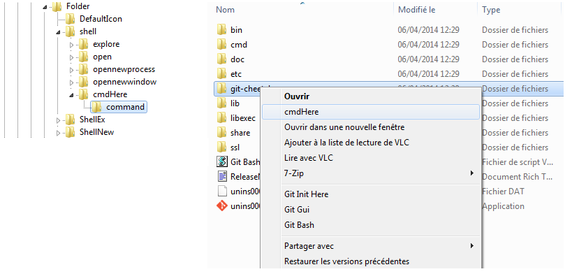

Pour ajouter une action au menu contextuel, il va falloir toucher à la base de registre de Window.




* Ouvrir la base de registre. (regedit)
* Aller dans: HKEY_LOCAL_MACHINE > software > Classes > folder > shell
* Ajouter une clé nommée <maNouvelleAction>.(cmdHere dans l’exemple)
* Puis ajouter une sous-clé nommée “command”. (ne pas changer le nom de la sous-clé).
* Double cliquer sur la sous-clé puis renseigner la valeur adaptée.

---

Exemples:

Ici on veut ouvrir une fenêtre DOS et placer le prompt à l'emplacement du répertoire où on a cliquer droit.
```
cmd.exe /k pushd "%L"
```


On peut aussi appeler un script (pour placer des variables d’environnement par exemple)
```
cmd.exe /k pushd "%L" & call I:\tools\bin\setup.bat
```
