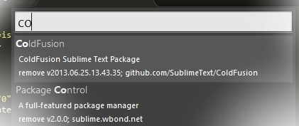

[cf love blog](http://cflove.org)

Switch to Sublime Text IDE for ColdFusion Developers.
I’m moving from Dreamweaver to Sublime Text.
Dreamweaver (DW) was my main IDE for almost a decade and it saved me good. Tag completion was excellent and I used bit of snippets too. It was reasonably stable and light, at least compared to Eclipse base IDEs. Search and Replace was excellent. Most impotently file management between remote/local servers were effortless. It works as well as ColdFusion Studio.

Recently JavaScript began to change my workflow and that make me rethink about my use of IDE and I searched. Sublime Text is where my search ended.

**Installation:**
Go to Sublime Text and install production version – it is version 2 as per today. Version 3 is in Beta and it is not going to work very well with CFM at this moment. Setup file is a 5MB file – compare that with DW or Eclipse.

**ColdFusion:**
There is [an official plugin](https://github.com/SublimeText/ColdFusion) (or as Sublime Text like to say, a Project) for ColdFusion. Download it, unzip it and copy into your package folder (Preferences> Browse Packages) in a new folder call “ColdFusion”. Wait, there is a much easier way to do this.

**Installing Package Control:**
Package Control is a package (plugin) that speeds up the package installation. You must have that. Go to [Sublime Text Package Control](https://sublime.wbond.net/installation) web site and copy the installation code. It is something looks like this:


Go to Sublime Text and press Ctrl+’ or click View>Show Console. Paste the code into the Console window at the bottom of the editor and Enter, Restart sublime Text.

**Installing Packages with Package Control:**
Press Ctrl+Shift+P or go to Tools > Command Pallette and type “package install” and hit Enter.

That will bring up another window with list of available packages, search for ColdFusion (or any other package name you like) and Enter– now you have ColdFusion support. Package installation does not get any easier than this.

**Language Support:**
Here is a something different form DW. Sublime Text choose code coloring and other functions base on the language and language is decided on the file extension. That means you get a different set of code coloring for .js and for .cfm files, snippets availability changes also. But if you want to change the language support for your file, for example, if you want to have full JavaScript support in your .cfm file, click on the bottom right corner of the sublime text and change the language.

**Projects:**
Sublime Text do not maintain a project list like DW, instead it lets us save a “project file”. Go to Project>Save Project As and save the file in any folder you like. You can add folders to your project using Project>Add Folder to Project. To open a project, go to Project>Open Project and open your project file from the location you saved it.

Sublime Text let us open multiple projects in multiple windows at the same time.

**File Explorer**
View > Side Bar > Show/Hide Side Bar bring up the File Explorer. Side Bar use single-click to expand folders and open files. Matter of fact, Sublime Text uses single-click whenever possible. That actually save fraction of a second compared to usual double clicks. It adds up.

In Sublime Text, we can go a long way without having the side panel open. Ctrl+P let you find and open our files with a fuzzy search.
**Shortcuts Keys**
Sublime text use shortcuts as much as Americans use Coffee. Use them. They save significant amount of valuable time. Those shortcuts are often not multiple key press, but they are key sequences. For example, the shortcut key to toggle sidebar is Ctrl+k,b. Meaning, hold the Ctrl key and then type K and then B. To delete a whole line press and hold Ctrl+K and then K again.

[source](http://cflove.org/2013/09/switch-to-sublime-text-ide-for-coldfusion-developers.cfm)
